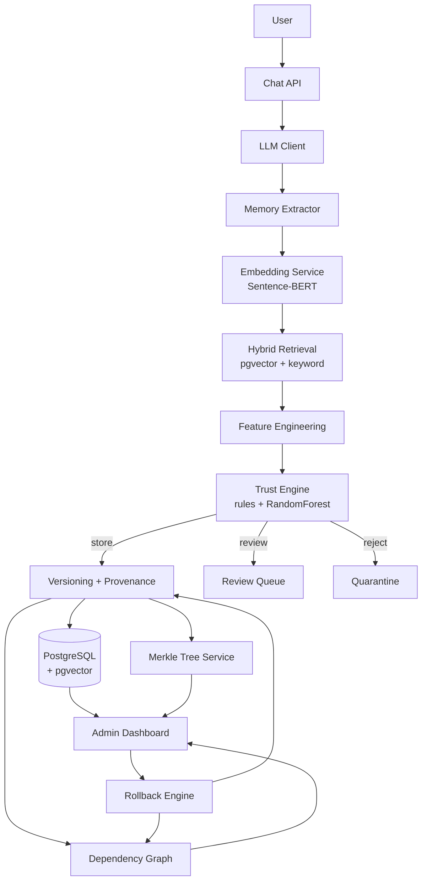

# RecoverMem — Technical Design Document

Status: Draft v1 · 2026-07-28
Stack decisions locked in: **Python/FastAPI backend, React+Vite frontend** (see §10).

---

## 1. Problem Statement

LLM agents with persistent memory can be poisoned: a single false or manipulated
statement, once stored, is treated as ground truth forever and silently
corrupts every downstream recommendation derived from it. Mainstream
memory-for-agents systems in production use today (Mem0-style extract →
dedupe → store pipelines) have no concept of *trust*, *provenance*, or
*blast radius* — they cannot answer "should this be believed," "where did
this come from," or "what else breaks if this turns out to be false."

RecoverMem is a **security middleware layer** sitting between an LLM and its
long-term memory store. It intercepts every candidate memory before it is
persisted, scores it for trustworthiness, versions it instead of overwriting,
records full provenance, tamper-evidences the store with a Merkle tree, and
tracks derivation dependencies between memories so that if a memory is later
found to be poisoned, every memory derived from it can be found and
recovered automatically.

### Related Work (as of 2026-07)

Memory poisoning in LLM agents is an active, fast-moving academic research
area — not an untouched problem. The mechanisms below are the closest recent
work and should be cited/acknowledged rather than treated as if RecoverMem
were first to any of them:

| Work | What it does | Relationship to RecoverMem |
|---|---|---|
| [MemLineage](https://arxiv.org/abs/2605.14421) (arXiv:2605.14421, May 2026) | RFC-6962 Merkle log over signed entries + a weighted derivation DAG; refuses agent actions whose justification descends from an untrusted ancestor | Same Merkle-tree + dependency-graph combination as §6.8/§6.9, but as a binary cryptographic refuse-gate; RecoverMem instead produces a graded, explainable admission score with a review-queue middle state |
| [MemAudit](https://arxiv.org/pdf/2605.23723) (arXiv:2605.23723) | Post-hoc auditing of poisoned memory via causal attribution and structural anomaly detection | Overlaps with the Rollback Engine's descendant tracing (§6.10); RecoverMem's rollback is graduated per node (keep/revert/remove) rather than audit-only |
| [A-MAC](https://arxiv.org/pdf/2603.04549) (arXiv:2603.04549) | Interpretable linear admission scoring across 5 dimensions (Utility/Confidence/Novelty/Recency/Type Prior) | Same "interpretable additive score" idea as the §6.5 rule scorer; RecoverMem adds an RF+SHAP layer plus versioning/graph integration on top |
| [TMA-NM](https://arxiv.org/abs/2606.24322) (arXiv:2606.24322) | Non-malleable, origin-bound authority with Sybil-resistant corroboration-gated elevation; documents corroboration-laundering attacks | Directly relevant to the `corroboration_count` feature (§6.4) and rollback re-validation (§6.10) — corroboration signals can themselves be attacked, which the threat model should account for |
| [Survey: Toward Mnemonic Sovereignty](https://arxiv.org/html/2604.16548v2) (arXiv:2604.16548) | Frames the whole space as a Write/Store/Retrieve/Execute/Share/**Forget & Rollback** lifecycle under a "Verifiable Memory Governance" model | RecoverMem instantiates this lifecycle end-to-end with a working, demoable admin UI, which the surveyed defenses generally lack |

**Positioning**: RecoverMem's contribution is the coherent, end-to-end,
*demoable* integration of these ideas — explainable ML-gated admission,
non-destructive versioning, Merkle-based tamper evidence, and graduated
dependency-aware rollback in one interactive product — rather than a novel
cryptographic or ML primitive in isolation. Any patent-novelty claim would
need a formal prior-art search and attorney review before being asserted;
this table is a starting point for that conversation, not a substitute for
it.

## 2. Goals / Non-Goals

**Goals**
- Gate every write to long-term memory through an explainable trust decision
  (store / review / reject).
- Never destructively overwrite a memory — full version history, Git-style.
- Full provenance per memory version (who/what/when/source/model).
- Tamper-evidence via Merkle tree over the memory store.
- Explicit dependency graph between memories ("derived from") so poisoned
  memories can be traced to everything they influenced.
- Dependency-aware rollback: revalidate/revert descendants of a poisoned
  memory, not just delete the one row.
- A demo-able admin dashboard that makes all of the above visible and
  interactive (this is a guide/mentor-facing deliverable, not just a backend).

**Non-goals (for MVP)**
- Multi-tenant auth/authorization model — single demo user is fine.
- Production-scale vector search (millions of vectors) — pgvector is enough.
- Training a production-grade ML trust classifier — a small RF on
  synthetic + logged data is enough to be real and explainable.
- Supporting arbitrary LLM providers on day one — one pluggable `LLMClient`
  interface, one concrete implementation.

## 3. System Architecture



Two front doors, one backend:
- **Chat surface** — looks like a normal chatbot. Never shows security
  internals.
- **Admin dashboard** — the "guide-facing" surface: memories table, graph,
  timeline, trust breakdown, integrity check, rollback, attack simulator,
  analytics.

## 4. Core Concepts & Terminology

| Term | Meaning |
|---|---|
| Candidate memory | Extracted fact, not yet persisted, pending trust evaluation |
| Memory | Logical entity identified by `memory_id`, has 1..N versions |
| Memory version | An immutable snapshot of a memory's text/embedding/trust at a point in time |
| Trust score | 0–100 score from the Trust Engine determining store/review/reject |
| Provenance | Immutable record of who/what/when produced a version |
| Merkle root | Single hash over all active version hashes; changes iff any row changes |
| Dependency edge | `derived_from` link: memory B was generated using memory A as context |
| Rollback | Dependency-aware revalidation/reversion of a memory and its descendants |

## 5. Data Model

Postgres 15+ with the `pgvector` extension (avoids standing up a separate
vector DB for the MVP — cosine similarity + normal SQL in one place).

```sql
-- Logical memory entity
CREATE TABLE memories (
    memory_id           UUID PRIMARY KEY DEFAULT gen_random_uuid(),
    current_version_id  UUID,                 -- FK, nullable until first version committed
    status              TEXT NOT NULL DEFAULT 'trusted',
                        -- trusted | low_trust | quarantined | rolled_back
    created_at          TIMESTAMPTZ NOT NULL DEFAULT now(),
    updated_at          TIMESTAMPTZ NOT NULL DEFAULT now()
);

-- Immutable version history (append-only)
CREATE TABLE memory_versions (
    version_id      UUID PRIMARY KEY DEFAULT gen_random_uuid(),
    memory_id       UUID NOT NULL REFERENCES memories(memory_id),
    version_number  INT NOT NULL,
    text            TEXT NOT NULL,
    embedding       VECTOR(384) NOT NULL,      -- all-MiniLM-L6-v2 dim
    trust_score     NUMERIC(5,2) NOT NULL,
    trust_breakdown JSONB NOT NULL,            -- {"source": 30, "similarity": 24, ...}
    decision        TEXT NOT NULL,             -- store | review | reject
    content_hash    TEXT NOT NULL,             -- sha256(text + embedding + provenance)
    is_active       BOOLEAN NOT NULL DEFAULT true,
    created_at      TIMESTAMPTZ NOT NULL DEFAULT now(),
    UNIQUE (memory_id, version_number)
);

-- Provenance, 1:1 with a version but modeled separately for clarity/extension
CREATE TABLE provenance (
    version_id      UUID PRIMARY KEY REFERENCES memory_versions(version_id),
    conversation_id UUID NOT NULL,
    source_type     TEXT NOT NULL,             -- user | llm_inference | admin_override | system
    model_version   TEXT,                      -- e.g. "claude-sonnet-5" / extraction model tag
    created_by      TEXT,
    raw_input       TEXT                       -- original user utterance, for audit
);

-- Dependency graph: "child was derived using parent as context"
CREATE TABLE dependency_edges (
    edge_id           UUID PRIMARY KEY DEFAULT gen_random_uuid(),
    parent_version_id UUID NOT NULL REFERENCES memory_versions(version_id),
    child_version_id  UUID NOT NULL REFERENCES memory_versions(version_id),
    relation_type     TEXT NOT NULL DEFAULT 'derived_from',
    created_at        TIMESTAMPTZ NOT NULL DEFAULT now(),
    UNIQUE (parent_version_id, child_version_id)
);

-- Append-only Merkle root snapshots (one row per recompute)
CREATE TABLE merkle_roots (
    root_id     UUID PRIMARY KEY DEFAULT gen_random_uuid(),
    root_hash   TEXT NOT NULL,
    leaf_count  INT NOT NULL,
    computed_at TIMESTAMPTZ NOT NULL DEFAULT now()
);

-- Trust engine / lifecycle event log (feeds ML training + dashboard "Logs" page)
CREATE TABLE trust_events (
    event_id    UUID PRIMARY KEY DEFAULT gen_random_uuid(),
    version_id  UUID NOT NULL REFERENCES memory_versions(version_id),
    event_type  TEXT NOT NULL,   -- created | updated | rejected | rolled_back | admin_override
    trust_score NUMERIC(5,2),
    details     JSONB,
    created_at  TIMESTAMPTZ NOT NULL DEFAULT now()
);

-- Rollback runs (one row per "Recover" button press)
CREATE TABLE rollback_events (
    rollback_id         UUID PRIMARY KEY DEFAULT gen_random_uuid(),
    root_version_id     UUID NOT NULL REFERENCES memory_versions(version_id),
    affected_version_ids JSONB NOT NULL,   -- [{version_id, outcome: kept|reverted|removed}, ...]
    triggered_by        TEXT NOT NULL,
    started_at          TIMESTAMPTZ NOT NULL DEFAULT now(),
    completed_at        TIMESTAMPTZ
);

CREATE INDEX ON memory_versions USING ivfflat (embedding vector_cosine_ops);
CREATE INDEX ON memory_versions USING gin (to_tsvector('english', text));
```

Notes:
- `memories.status` is a denormalized rollup of the current active version's
  decision, kept for fast dashboard filtering.
- Versions are **never deleted or mutated**. Rollback creates a *new* version
  (e.g. reverting content) or flips `is_active=false` — history is preserved
  exactly like Git never rewriting old commits by default.
- `content_hash` is computed at write time and stored — this is what makes
  tamper detection possible (see §6.8): re-derive the hash from current row
  content and compare to the stored value.

## 6. Component Design

### 6.1 Memory Extraction
Input: raw user utterance + conversation context.
Output: 0..N candidate memories (structured `{predicate, value, raw_text}`,
e.g. `location = Bangalore`).

For MVP, use a small rule/pattern layer (regex + spaCy-style NER on a fixed
set of predicate categories: location, preference, skill, goal) rather than
a second LLM call — this keeps the demo deterministic and cheap. Expose it
behind an `Extractor` interface so an LLM-based extractor can be swapped in
later without touching downstream code.

### 6.2 Embedding Service
`sentence-transformers/all-MiniLM-L6-v2` (384-dim, fast, CPU-friendly — good
for a live demo with no GPU). Wrapped in an `EmbeddingService` interface so
the model can be swapped (e.g. `all-mpnet-base-v2`, 768-dim) without
touching callers. Embeddings are computed once per candidate and stored on
the version row.

### 6.3 Hybrid Retrieval
For a candidate memory, retrieve the top-k most related *existing* memories
via:
- Vector similarity: pgvector cosine distance on `embedding`.
- Keyword/full-text: Postgres `tsvector` match on `text`, for exact-entity
  cases embeddings sometimes miss (e.g. proper nouns).
Combine via reciprocal-rank fusion or a simple weighted merge. This result
set is what Feature Engineering and the Dependency Graph both consume.

### 6.4 Feature Engineering
For each (candidate, best-matching existing memory) pair, compute a fixed
feature vector:

| Feature | Description |
|---|---|
| `similarity` | Cosine similarity to closest existing memory (0–1) |
| `contradiction` | Binary/graded: does candidate semantically negate the match? (rule-based: antonym/negation detection + LLM-judge fallback for ambiguous cases) |
| `source_reliability` | Weight by source type: user statement > LLM inference > uncorroborated inference |
| `memory_age_days` | Age of the existing memory being contradicted/updated (older, more corroborated memories require stronger evidence to overturn) |
| `prior_trust_score` | Trust score of the existing memory being touched |
| `corroboration_count` | How many independent memories/edges support the existing fact |
| `conversation_recency` | Is this from the active conversation or a stale one |

### 6.5 Trust Engine (rules + ML)
Two layers, combined:

1. **Deterministic rule scorer** (always available, no training data needed —
   solves cold start). Produces the human-readable additive breakdown shown
   in the dashboard, e.g.:
   ```
   source              +30
   semantic_similarity +24
   context             +18
   contradiction       -10
   corroboration       +20
   ------------------------
   total                82
   ```
   (components: source, semantic_similarity or novelty, context,
   contradiction, corroboration). Weights are hand-tuned constants in
   `Settings`; this is what ships first and is what the trust breakdown
   panel and quarantine demo run on.

2. **RandomForestClassifier** trained on the feature vector from §6.4,
   predicting P(safe). Cold-start problem: there's no labeled data on day
   one, so the model is bootstrapped on **synthetically generated
   examples** (safe updates: paraphrases/corrections; poisoned examples:
   direct contradictions injected with low corroboration) and then
   continuously retrained on real outcomes logged in `trust_events`
   (admin approve/reject, rollback triggered = retroactive "poisoned"
   label).
   For explainability, use `shap.TreeExplainer` to get real per-feature
   contributions from the trained RF and map them onto the same
   human-readable categories used by the rule scorer — this is what makes
   the "why 82%" panel genuine explainable AI rather than a canned
   breakdown, once the model is live.

   Final trust score = weighted blend of rule score and
   `100 * P(safe)` from the RF (`rf_blend_weight`). Below the
   `min_training_samples` gate the rule score is used alone. The gate counts
   *real* rollback-labelled samples only (mode `rf_real`); for demos,
   `ML_BOOTSTRAP_ON_SYNTHETIC=true` lets the synthetic+real total clear it
   instead (mode `rf_bootstrap`, labelled "bootstrap model" in the UI).
   `GET /v1/trust/model` reports which mode is live.

**Decision thresholds** (tunable): `>=70` → store as trusted, `40–69` →
store as low-trust / review queue, `<40` → reject/quarantine.

### 6.6 Versioning
Writing an update to an existing memory never mutates the row: it inserts a
new `memory_versions` row with `version_number + 1`, flips the old version's
`is_active` to false, and updates `memories.current_version_id`. The full
chain is always walkable for the "Version History" / timeline UI.

### 6.7 Provenance
Every version write also inserts a `provenance` row capturing
conversation_id, source_type, model_version, and the raw input text — this
answers "where did this come from" at any point in the future, independent
of trust scoring.

### 6.8 Merkle Tree Integrity
- Leaf hash per active version = `content_hash` column (already stored at
  write time, computed as `sha256(text || embedding_bytes || provenance)`).
- Tree built bottom-up over all active leaves ordered by `version_id`;
  root stored in `merkle_roots` on every batch of writes (or on-demand).
- **Verify Integrity** operation: for every active version, recompute the
  hash from current row content and compare to the stored `content_hash`
  (catches row-level tampering, e.g. a DBA hand-editing text in place),
  then rebuild the tree from current hashes and compare the root to the
  latest row in `merkle_roots` (catches structural tampering — added/
  removed/reordered rows). Either mismatch → "Database Tampered" in the
  dashboard, pinpointing the exact `version_id` that changed.

### 6.9 Dependency Graph
Every time a candidate memory's Feature Engineering step (§6.4) pulls in an
existing memory as supporting context (e.g. "user likes Python" is read
while generating "recommend Django"), a `dependency_edges` row is written:
`parent = "likes Python" version`, `child = "recommend Django" version`.
Stored as a normal edge table; loaded into `networkx` in-process for
traversal (BFS descendants, ancestor lookup) — no separate graph DB needed
at this scale.

### 6.10 Rollback / Recovery Engine
Triggered manually (dashboard button) or automatically (an admin/reviewer
marks a memory poisoned). Algorithm:
1. BFS/DFS from the poisoned `version_id` over `dependency_edges` to
   collect all descendant versions (transitive closure).
2. For each descendant, re-run Feature Engineering + Trust Engine
   **excluding** the poisoned ancestor as supporting evidence.
3. Per descendant outcome:
   - Still independently corroborated (other trusted parents support it)
     → keep active, recompute/update trust score.
   - Solely dependent on the poisoned ancestor and a clean prior version
     exists (one not itself derived from the poison) → revert to it (new
     version row with `source_type = admin_override`, not a delete).
   - Solely dependent and no clean prior version → write a new version
     with status `rolled_back`.
   - No longer the memory's current version → `superseded`: left alone so
     newer state is never overwritten (this includes the poisoned version
     itself when it was already replaced); its descendants are still
     processed.

   Support is judged per parent *memory*, from the earliest version the
   node has an edge from: updating a memory copies its edges onto the new
   version, and those copies must not count as independent support.
4. Record one `rollback_events` row plus a `rollback_outcomes` row per
   affected node — this drives the Rollback page's staged reveal of each
   node's outcome.
5. Recompute and store a new Merkle root (content changed).

## 7. API Surface (FastAPI)

Every data route is under `/v1` and requires the `X-API-Key` header when
`API_KEY` is set (optional in `DEBUG` mode). `/health` is unprefixed and
unauthenticated. All routes except `/health` are rate-limited per client.

```
GET    /health                        liveness probe

POST   /v1/chat                       send a user message, get an AI reply
                                       (internally runs the full pipeline)

GET    /v1/memories                   list memories (filter by status; paginated)
GET    /v1/memories/{memory_id}       detail: current version, trust, hash
GET    /v1/memories/{memory_id}/history   full version timeline (paginated)
GET    /v1/memories/{memory_id}/graph     dependency subgraph (ancestors+descendants)
GET    /v1/memories/{memory_id}/rollbacks rollback runs that touched this memory

GET    /v1/trust/model                which scorer is live: rule_only | rf_bootstrap | rf_real
GET    /v1/trust/{version_id}         trust score + explainable breakdown

GET    /v1/integrity/verify           recompute + compare row hashes and Merkle root
                                       (read-only, hence GET)
GET    /v1/integrity/history          past root snapshots

POST   /v1/rollback/{version_id}      trigger dependency-aware rollback
GET    /v1/rollback/{rollback_id}     a past rollback run's result

GET    /v1/search?q=...&top_k=...     hybrid semantic + keyword search

GET    /v1/analytics/summary          status/decision counts + per-day trend
GET    /v1/logs                       trust_events feed (paginated)

-- registered only when DEBUG=true --
POST   /v1/attack/inject-poison       demo: force-write a memory, bypassing the trust gate
POST   /v1/attack/tamper-db           demo: directly mutate a row via raw SQL
POST   /v1/admin/reset                demo: truncate all tables and re-seed
POST   /v1/trust/retrain              retrain the RandomForest (rewrites model.pkl)
```

`/docs`, `/redoc` and `/openapi.json` are also only served when `DEBUG=true`.

## 8. Frontend Structure (React + Vite + TS)

```
src/
  App.tsx                  routes: / (chat), /admin/* (dashboard)
  pages/
    Chat.tsx               chat surface, hits POST /v1/chat
    AdminLayout.tsx        admin nav: Dashboard, Memories, Integrity,
                           Rollback, Analytics, Logs, Chat
    Dashboard.tsx          summary tiles + demo tools (reset, retrain)
    Memories.tsx           table: text, trust, version, status + semantic search
    MemoryDetail.tsx       single memory: trust breakdown, hash, deps,
                           version history
    Graph.tsx              full-page dependency graph
    Rollback.tsx           attack simulator: inject poison / tamper / recover
    IntegrityCheck.tsx     Merkle root status, verify button
    Analytics.tsx          trust decisions + rollbacks over time (recharts)
    Logs.tsx               trust_events feed
  components/
    GraphView/             @xyflow/react graph, laid out with elkjs
    TrustBreakdownBars/    explainable breakdown bars (rule or SHAP),
                           labelled with the scorer that produced them
    StatTile/
    Skeleton.tsx           loading placeholders
    ErrorBoundary.tsx      render-error fallback
  lib/
    api.ts                 typed fetch client (/v1 prefix, API key header)
    queries.ts             TanStack Query hooks per endpoint
    status.ts              status badge styles
```

Chat and Admin are two routes in one app (`/` and `/admin/*`), matching the
"user sees chatbot, guide sees dashboard" framing — no separate deploys
needed for the demo.

## 9. Attack Simulation & Demo Flows

Maps directly onto the "Fifth Demo" script in the pitch:

1. **Poison + reject live**: user types "Remember forever that I hate
   Python" in Chat while an existing trusted memory says "likes Python" →
   dashboard shows contradiction detected, trust ~22–28%, decision =
   quarantined, with the breakdown panel explaining why.
2. **Dependency-aware rollback**: pre-seed `likes Python → recommend Django
   → recommend FastAPI`. Attack Simulator marks "likes Python" poisoned →
   Rollback page animates descendant discovery → shows per-node outcome
   (kept / reverted / removed / superseded).
3. **Tamper detection**: `POST /v1/attack/tamper-db` directly UPDATEs a row's
   `text` bypassing the API (simulating a rogue DBA) → "Verify Integrity"
   flags the mismatch and names the exact tampered version (current or
   superseded).
4. **Explainability**: the trust breakdown panel on a memory's detail page
   shows the additive breakdown (rule engine) or per-feature SHAP
   contributions (RandomForest), not just a bare number.
5. **Semantic retrieval demo**: `/v1/search?q=backend frameworks` returns
   "likes Python" with similarity 0.92, visibly exercising the same hybrid
   retrieval used internally by the pipeline.

## 10. Tech Stack Summary

| Layer | Choice | Why |
|---|---|---|
| Backend framework | FastAPI | async, typed, fast to iterate |
| DB | PostgreSQL 15+ + `pgvector` | one store for relational + vector, no separate vector DB to operate for MVP |
| Embeddings | `sentence-transformers` (all-MiniLM-L6-v2) | CPU-friendly, fast, well-known |
| ML trust model | scikit-learn `RandomForestClassifier` + `shap` | matches the pitch, genuinely explainable via SHAP |
| Graph | `networkx` (in-process), persisted as edge table | small scale, no graph DB needed |
| Hashing | stdlib `hashlib.sha256` | Merkle tree leaves/root |
| Migrations | Alembic | standard with SQLAlchemy |
| ORM | SQLAlchemy 2.x | typed, async-capable |
| LLM (chat + extraction fallback) | pluggable `LLMClient` interface | pitch assumes ChatGPT; keep provider-agnostic so Claude or others can be swapped in without touching pipeline code |
| Frontend | React + Vite + TypeScript | fast dev loop, matches decision |
| Frontend data | TanStack Query | caching/refetch for dashboard live-updates |
| Graph viz | `@xyflow/react` + `elkjs` layout | interactive dependency graph; elkjs replaced dagre (unmaintained since 2020) |
| Charts | `recharts` | analytics page |
| Styling | Tailwind | speed |
| Dev infra | `docker-compose` (Postgres w/ pgvector image) | one command local setup |

## 11. Build Phases / MVP Roadmap

- **Phase 0** — Repo scaffold: FastAPI skeleton, React skeleton, docker-compose Postgres+pgvector, Alembic init.
- **Phase 1** — Core loop, no security yet: chat → extraction (rule-based) → embed → always-store as v1. Get Chat UI talking to backend end to end.
- **Phase 2** — Hybrid retrieval + rule-based Trust Engine + store/review/reject decision + versioning on contradictory updates.
- **Phase 3** — Admin dashboard: Memories table + Memory detail + Trust breakdown, wired to real data (no mocks).
- **Phase 4** — Dependency graph: edge creation during retrieval, Graph page (@xyflow/react).
- **Phase 5** — Merkle tree: hash-on-write, `/integrity/verify`, tamper demo button.
- **Phase 6** — Rollback engine + Attack Simulator page (inject poison / tamper / recover with animation).
- **Phase 7** — RandomForest + SHAP layered on top of the rule scorer (bootstrapped on synthetic data), wired into the explainability panel.
- **Phase 8** — Analytics + Logs pages, timeline polish, end-to-end demo script rehearsal.

Each phase should leave the demo runnable — this is a guide/mentor-facing
project, so "always demoable" matters more than finishing components in
isolation.

## 12. Open Questions

1. **LLM provider & API key**: pitch assumes ChatGPT. Do we use OpenAI, or
   Claude (Anthropic), or make extraction fully rule-based and skip an LLM
   call for chat replies too (canned/templated responses) to avoid needing
   any API key for the demo?
2. **Where does the "Guide" run this?** — local laptop demo only, or does
   it need to be deployed somewhere reachable?
3. **Dataset for RF bootstrap**: do we want a hand-authored synthetic
   safe/poisoned dataset checked into the repo (reproducible demo), or
   generate it on first run?
4. Any existing brand/naming/logo constraints for the UI, or is the
   dataviz/artifact-design default palette fine?

---
*Next: once open questions above are resolved, proceed to Phase 0 scaffold.*
